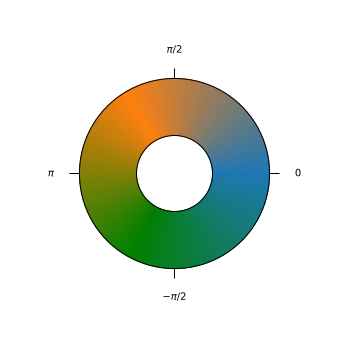
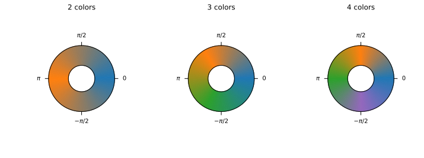

# SlopeOrientation

SlopeOrientation is a Python library to create and use cyclic colormaps with Matplotlib.

Cyclic colormaps can represent the spatial distribution of an angle.

## Quick example

```python
import SlopeOrientation.CyclicColormap as cc
from pylab import *

cmap = cc.cyclic_colormap()

figure( '', ( 6, 6 ) )
cc.cyclic_colorbar( cmap, ax = gca() )

xticks([]); yticks([]);

show()
```


## Create colormaps

The colormap should go through three colors at least.

```python
import SlopeOrientation.CyclicColormap as cc
from pylab import *

color_path = [ 'tab:blue', 'tab:orange', 'tab:green', 'tab:purple' ]

figure('',(12,4))

for i in range( 2, 5 ) :
    subplot(1, 3, i-1)
    cmap = cc.cyclic_colormap( color_path = color_path[:i] )
    cc.cyclic_colorbar( cmap, ax = gca() )
    gca().set_title( str(i) + ' colors' )

show()
```


## Plot a complex analytic function

```python
import SlopeOrientation.CyclicColormap as cc
from pylab import *

x = linspace(-1,1,100)
y = x
X,Y = meshgrid(x,y)
z = X + 1j*Y
f = ( z - .5 )*( z + .2 +.5j )**3

figure('', ( 6, 6) )
cmap = cc.cyclic_colormap()
imshow( angle(f), cmap = cmap, extent = ( min(x), max(x), min(y), max(y)) )

axis('equal')

cc.cyclic_colorbar( cmap )

show()
```


## Slope orientation of a topographic map

```python
import SlopeOrientation.CyclicColormap as cc
from pylab import *

h = loadtxt('../Data/h.csv')

dxh, dyh = gradient(h)
orientation = angle( dxh + 1j*dyh )

figure('',(6,6))
margin = .05
axes([ margin, margin, 1-2*margin, 1-2*margin ])

cmap = cc.cyclic_colormap()

contour( h, colors = 'white', linestyles = '--', alpha = .3 )
imshow( orientation, cmap = cmap )
axis('equal')
axis('off')

cc.cyclic_colorbar( cmap, ticks = cc.geo_ticks )

show()
```


